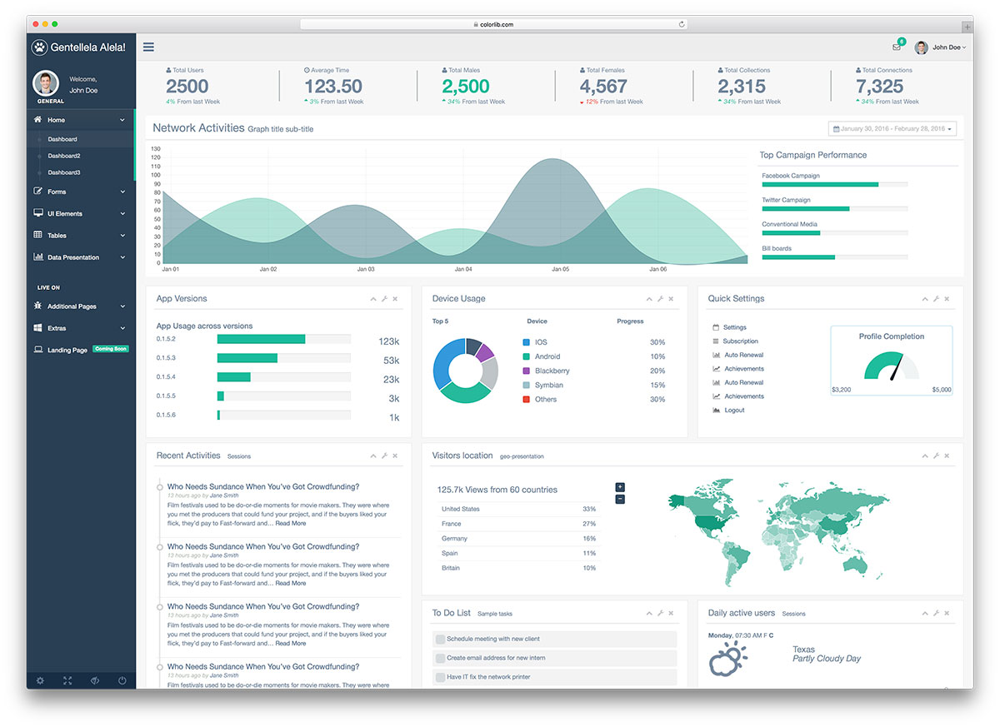
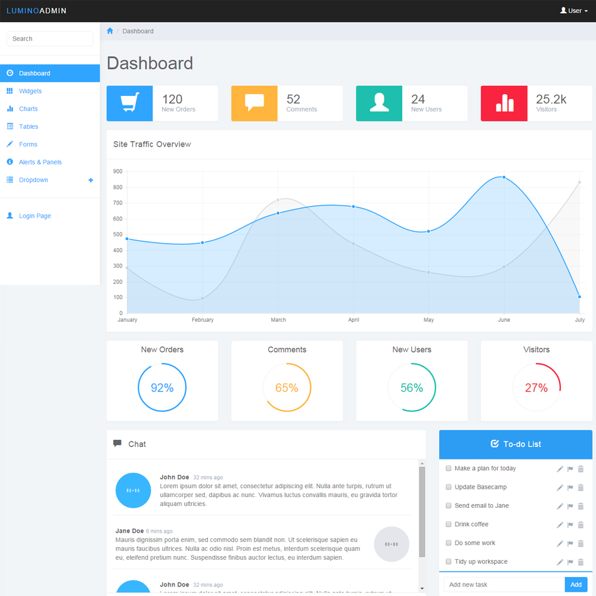
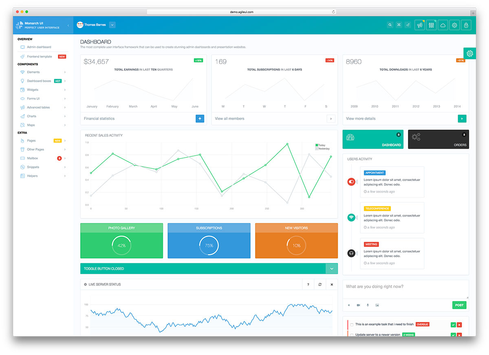

Bootstrap Themes
================

Here are some bootstrap these that I've picked out.  The main areas to concentrate on are...

- Type face
- Left menu styling
- Top menu styling

### The look we're going for is

- Modern
- Professional
- Clean
- Trustworthy

## 1. Original Template

This is the original template that I'm using, the menu bar on the side appears a little messy with the dark colours and heaps of lines / icons going on.

## 1. Lumino

Nice and clean, only thing is we want to avoid looking like Microsoft Windows with the tiles.

## 3. Monarch

Again very clean, we will not have as many graphs as this

